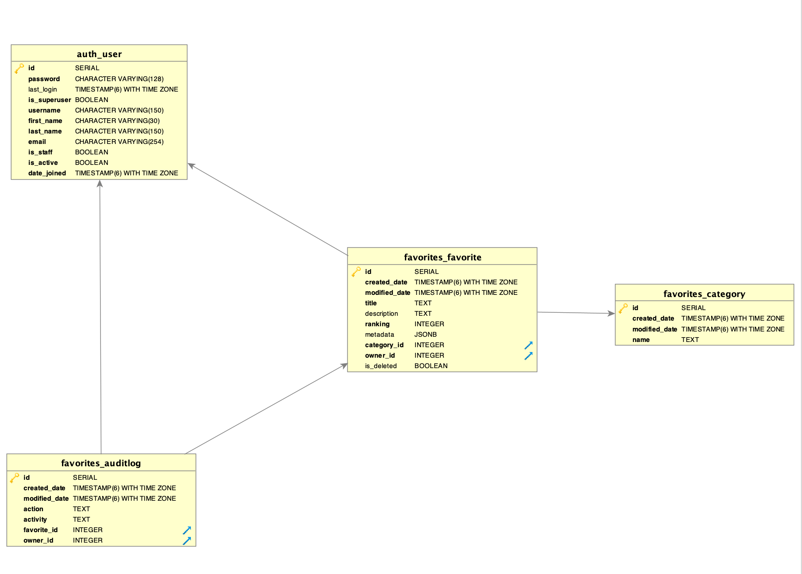

# favorite-things
[View App Here](https://favorite-things.tosmak.me/)

This project is an application that allows users to track their favorite things.

## Table of Contents

- [Features](#features)
- [Development Process](#Development-Process)
- [Deployment Process](#Deployment-Process)
- [Api-docs](#Api-docs)
- [Technologies](#technology)
- [Architecture](#Architecture)
- [Application setup](#App-setup)
- [Testing](#testing)
- [Contribution](#contribution)
- [Frequently Asked Questions](#faqs)
- [License](#license)

## Features

It consists of the following features:

- Users can and login register.
- Users can create category.
- Users can create favorites-things.
- Users can edit favorites-things.
- Users can delete favorites-things.
- Users can filter favorites-things by category.
- Users can sort favorites-things.
- Users can view audit logs.

## Development-Process

Favorite things app contains 4 entities. Favorite, Category, Audit-Logs and User. Shown below is the development process.

- Created a github repo.
- Set up server application.
- Created an ERD model to clearly see how the entities would interact.
- Created Models and created migrations.
- Implemented user registration and authentication.
- Implemented create category.
- Implemented create, get, update and delete favorite-things.
- Wrote tests to assert changes.
- Implemented ranking update.
- Wrote test fro ranking update.
- Implemented create and get Audit log using Django Signals.
- Wrote test fpr Audit logs features.
- Added pagination, sorting and filtering features
- Setup deployment using zappa.
- Added deployment scripts.
- Added Circle CI for CI/CD to ensure test are passed before deployment.
- Set up client side.
- Hosted both client and server using Zappa.
- Used Route 53 to route favorite-things url to to link generated by zappa.
- Impemented client side features

## Deployment-Process

Favorite-things is hosted in AWS Lambda using Zappa. With Zappa, each request is given its own virtual HTTP "server" by Amazon API Gateway. AWS handles the horizontal scaling automatically, so no requests ever time out. 
The deployment process is automated as shown in yml file in the .circle CI file. A detailed deployment process is listed below.

- zappa init (To add deployment config, though this is already included in the zappa_settings.json in server folder).
- To deploy manually, run `zappa deploy dev`. 
- For subsequent deployment, simply run `zappa update dev`
- For automated deployment, setup circle CI.
- Create a pull request.
- Merge to develop when all tests have passed. An updated deployment should be triggered to deploy the app.

## Api-docs
Check out the API docs at [Favorite-things-API-DOCS](https://favorite-things-api.tosmak.me/docs/)

## Technology
**Favorite-Things** makes use of a host of modern technologies. The core ones are:
- [Django](https://www.djangoproject.com/)
- [Django rest framework](https://www.django-rest-framework.org/)
- [Vue](https://vuejs.org/)
- [Vuex](https://vuex.vuejs.org/)
- [Postgres](https://www.postgresql.org/)
- [Zappa](https://www.zappa.io/)
- [Docker](https://www.docker.com/)

## Architecture
It's a Monolith Architecture. Below is the application backend Database Design and Architecture

## App-setup

### Server side setup

- Clone the repository
- Change into the directory `$ cd /favorite-things/server`.
- Install all required dependencies with `$pipenv install`.
- Create a `.env` file in server directory as described in `.env.sample` file.
- Start the app with `pipenv run server`.

### Client side setup

- Change into the directory `$ cd /favorite-things/client`.
- Install all required dependencies with `$npm install`.
- Create a `.env` file in client directory as described in `.env.production` file.
- Start the app with `npm run serve`.

### Docker setup

- Ensure you have docker installed
- Create a `.env` file in server directory as described in `.env.sample` file.
- Create a `.env` file in client directory as described in `.env.production` file.
- Run `$docker-compose build` to build the application,
- Run `docker-compose up` to run the application.
- You can access the server and client on http://127.0.0.1:8000/ and http://127.0.0.1:8080/login, respectively.

## Testing

- `Run pipenv run tests`

## Contribution

- Fork this repository to your GitHub account
- Clone the forked repository
- Create your feature branch
- Commit your changes
- Push to the remote branch
- Open a Pull Request

## FAQs

Contact tosmak16@gmail.com

## LICENSE

#### [MIT](./LICENSE) © [Oluwatosin Akinola]

Copyright (c) 2019 Oluwatosin Akinola
